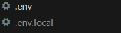

# Projet Form Sécurisée

Ce projet est en lien avec la sécurité informatique. Il comprend un formulaire de connexion il vérifie si vous êtes enregistrées à la base de données.
On peut retrouver un formulaire d’enregistrement où on peut créer un nouveau utilisateur.

Ces deux formulaires cherches à éviter les faille de sécurité.

Le projet a été réalisée en PHP 8.2.0 et JS
## Installer le projet
1) Installer composer https://getcomposer.org/download/

2) Clone le Repository
```
git clone https://github.com/Sammatrice-Lorenzo/Projet-Form-Secure.git
```
3) Installer les dépendances  

```
composer install
```

4) Pour run l'application il faut avoir un wamp xamp lamp

5) Il faut ajouter un fichier .env.local à la racine du projet pour ajouter ces variables
- PASSWORD_BD= <"le password de votre bdd">
- USER_NAME= <"le username pour se connecter à la bdd">
- SERVER= <"le nom du serveur">
- DB_NAME= <"le nom de la base">
- PORT= <"le port est souvent le 3306">

Voici un example ici (le port peut-être optionnelle cela dépend de votre configuration):
- PASSWORD_BD=
- USER_NAME=root
- SERVER=localhost
- DB_NAME=db
- PORT=


    

Voici quelque user et mot de passe pour se connecter : 
- 1
    - Login : lesterhowell@gmail.com
    - Mdp : stz7JGdjnvUky65!
- 2
    - Login : luisvongor@gmail.com
    - Mdp : Rjd83eUdh93W6V!
- 3
    - Login : marcleclere@gmail.com
    - Mdp : G5i2s6e5Vy5xFC!